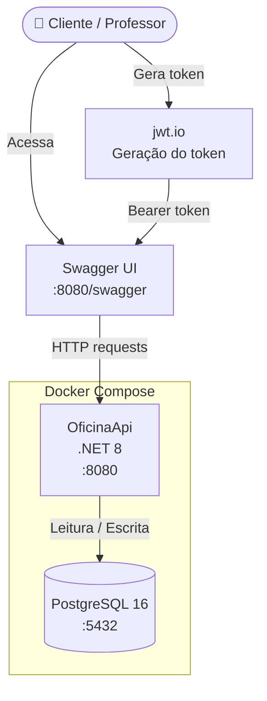
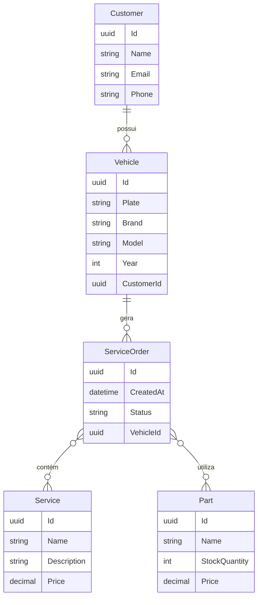
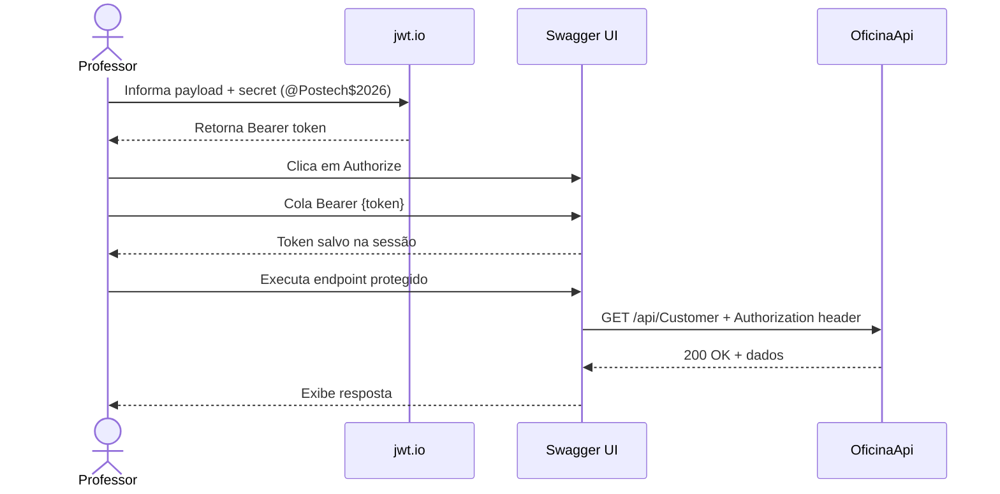
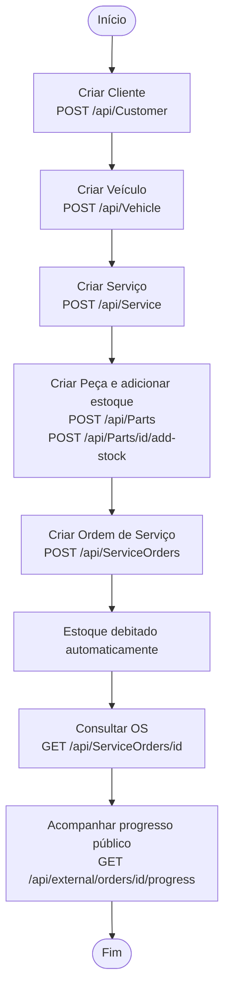

# Oficina Mecânica API

API RESTful para gerenciamento de uma oficina mecânica, desenvolvida com .NET 8, PostgreSQL e Docker.

---

## Índice

- [Pré-requisitos](#pré-requisitos)
- [Arquitetura](#arquitetura)
- [Modelo de dados](#modelo-de-dados)
- [Fluxo de autenticação](#fluxo-de-autenticação)
- [Fluxo principal — Ordem de Serviço](#fluxo-principal--ordem-de-serviço)
- [Configuração do ambiente](#configuração-do-ambiente)
- [Subindo a aplicação](#subindo-a-aplicação)
- [Banco de dados e migrations](#banco-de-dados-e-migrations)
- [Autenticação JWT](#autenticação-jwt)
- [Documentação Swagger](#documentação-swagger)
- [Endpoints disponíveis](#endpoints-disponíveis)
- [Exemplos de requisição](#exemplos-de-requisição)
- [Testes](#testes)
- [Análise de segurança do código](#análise-de-segurança-do-código)

---

## Pré-requisitos

- [Docker](https://www.docker.com/) e Docker Compose instalados
- Git

---

## Arquitetura



---

## Modelo de dados



---

## Fluxo de autenticação



---

## Fluxo principal — Ordem de Serviço



---

## Configuração do ambiente

Crie o arquivo `.env` na raiz do projeto com o conteúdo abaixo (credenciais do ambiente de testes):

```env
# Banco de dados
DB_USER=postgres
DB_PASSWORD=@Postech$2026
DB_NAME=oficina_db
DB_CONNECTION_STRING=Host=db;Port=5432;Database=oficina_db;Username=postgres;Password=@Postech$2026

# JWT
JWT_SECRET=@Postech$2026
JWT_ISSUER=oficina-api
JWT_AUDIENCE=oficina-clientes
```

> Esses valores já estão configurados para o ambiente de testes. Não é necessário alterar nada para subir e testar a aplicação.

---

## Subindo a aplicação

```bash
# Primeira vez ou após alterações no código
docker compose up --build -d

# Nas próximas vezes (sem alterações de código)
docker compose up -d

# Parar a aplicação
docker compose down
```

Verifique se os containers subiram:

```bash
docker compose ps
```

---

## Banco de dados e migrations

A migration é aplicada automaticamente na primeira vez que a aplicação sobe. Caso precise aplicar manualmente:

```bash
docker compose exec api dotnet ef database update
```

Se precisar recriar o banco do zero:

```bash
docker compose down -v   # remove os volumes
docker compose up -d
```

---

## Autenticação JWT

A maioria dos endpoints é protegida por JWT. Para testá-los você precisa gerar um token.

### Gerando o token via [jwt.io](https://jwt.io)

1. Acesse [https://jwt.io](https://jwt.io)
2. No painel **Decoded**, preencha:

**Header:**
```json
{
  "alg": "HS256",
  "typ": "JWT"
}
```

**Payload:**
```json
{
  "sub": "qualquer-id",
  "email": "teste@email.com",
  "jti": "qualquer-uuid",
  "iss": "oficina-api",
  "aud": "oficina-clientes",
  "exp": 9999999999
}
```

3. No campo **Verify Signature**, cole a secret abaixo:
```
@Postech$2026
```
4. Copie o token gerado no painel esquerdo

### Usando o token no Swagger

1. Acesse o Swagger: `http://<seu-host>:8080/swagger`
2. Clique no botão **Authorize** (cadeado verde no topo da página)
3. No campo **Value**, digite:
```
Bearer <token_gerado>
```
4. Clique em **Authorize** e depois em **Close**
5. A partir deste momento todos os endpoints protegidos já aceitarão o token

---

## Documentação Swagger

Acesse a documentação interativa da API:

```
http://localhost:8080/swagger
```

---

## Endpoints disponíveis

### Customer — Clientes
| Método | Rota | Descrição | Auth |
|--------|------|-----------|------|
| GET | `/api/Customer` | Lista todos os clientes | ✅ |
| GET | `/api/Customer/{id}` | Busca cliente por ID | ✅ |
| POST | `/api/Customer` | Cria novo cliente | ✅ |
| PUT | `/api/Customer/{id}` | Atualiza cliente | ✅ |
| DELETE | `/api/Customer/{id}` | Remove cliente | ✅ |

### Vehicle — Veículos
| Método | Rota | Descrição | Auth |
|--------|------|-----------|------|
| GET | `/api/Vehicle` | Lista todos os veículos | ✅ |
| GET | `/api/Vehicle/{id}` | Busca veículo por ID | ✅ |
| POST | `/api/Vehicle` | Cria novo veículo | ✅ |
| PUT | `/api/Vehicle/{id}` | Atualiza veículo | ✅ |
| DELETE | `/api/Vehicle/{id}` | Remove veículo | ✅ |

### Service — Serviços
| Método | Rota | Descrição | Auth |
|--------|------|-----------|------|
| GET | `/api/Service` | Lista todos os serviços | ✅ |
| GET | `/api/Service/{id}` | Busca serviço por ID | ✅ |
| POST | `/api/Service` | Cria novo serviço | ✅ |
| PUT | `/api/Service/{id}` | Atualiza serviço | ✅ |
| DELETE | `/api/Service/{id}` | Remove serviço | ✅ |

### Parts — Peças / Estoque
| Método | Rota | Descrição | Auth |
|--------|------|-----------|------|
| GET | `/api/Parts` | Lista todas as peças | ✅ |
| GET | `/api/Parts/{id}` | Busca peça por ID | ✅ |
| POST | `/api/Parts` | Cria nova peça | ✅ |
| POST | `/api/Parts/{id}/add-stock` | Adiciona estoque | ✅ |
| POST | `/api/Parts/{id}/remove-stock` | Remove estoque | ✅ |
| DELETE | `/api/Parts/{id}` | Remove peça | ✅ |

### ServiceOrders — Ordens de Serviço
| Método | Rota | Descrição | Auth |
|--------|------|-----------|------|
| GET | `/api/ServiceOrders/{id}` | Busca OS por ID | ✅ |
| POST | `/api/ServiceOrders` | Cria nova OS | ✅ |

### ExternalQuery — Consulta Pública
| Método | Rota | Descrição | Auth |
|--------|------|-----------|------|
| GET | `/api/external/orders/{id}/progress` | Acompanha progresso da OS | ❌ |
| GET | `/api/external/metrics/average-execution-time` | Tempo médio de execução | ❌ |

> ✅ Requer token JWT &nbsp;&nbsp; ❌ Rota pública

---

## Exemplos de requisição

### Criar cliente

```bash
curl -X POST http://localhost:8080/api/Customer \
  -H "Content-Type: application/json" \
  -H "Authorization: Bearer <seu_token>" \
  -d '{
    "name": "João Silva",
    "email": "joao@email.com",
    "phone": "11999999999"
  }'
```

### Criar veículo

```bash
curl -X POST http://localhost:8080/api/Vehicle \
  -H "Content-Type: application/json" \
  -H "Authorization: Bearer <seu_token>" \
  -d '{
    "plate": "ABC1D23",
    "brand": "Toyota",
    "model": "Corolla",
    "year": 2022,
    "customerId": "<id_do_cliente>"
  }'
```

### Criar ordem de serviço

```bash
curl -X POST http://localhost:8080/api/ServiceOrders \
  -H "Content-Type: application/json" \
  -H "Authorization: Bearer <seu_token>" \
  -d '{
    "vehicleId": "<id_do_veiculo>",
    "services": [{ "id": "<id_do_servico>" }],
    "parts": [{ "id": "<id_da_peca>", "quantity": 2 }]
  }'
```

### Consultar progresso de uma OS (pública)

```bash
curl http://localhost:8080/api/external/orders/<id_da_os>/progress
```

---

## Testes

O projeto conta com uma suíte de **257 testes automatizados** (0 falhas), cobrindo os principais fluxos de domínio.

### Executar os testes

```bash
dotnet test tests/OficinaApi.Tests/OficinaApi.Tests.csproj
```

### Distribuição

| Categoria | Cobertura |
|-----------|-----------|
| Controllers (Auth, Users, Customers, Vehicles, ServiceOrders) | ✅ Unitários |
| Services (UserService, TokenService, EmailService, PartService, ServiceOrderService) | ✅ Unitários |
| Domain Entities (ServiceOrder, Part, Service, Vehicle, Customer) | ✅ Unitários |
| Value Objects (CPF/CNPJ, Placa) | ✅ Unitários |
| Repositórios | ✅ Unitários |
| Fluxos de integração (Customers, Parts, Services, ServiceOrders, Vehicles) | ✅ Integração |

---

## Análise de segurança do código

O relatório completo de análise estática do código está disponível em:

📄 [`docs/relatorio-scan-codigo.md`](docs/relatorio-scan-codigo.md)

### Resumo dos achados

| Categoria | Risco | Status |
|-----------|-------|--------|
| Injeção de SQL | Nenhum | ✅ OK |
| Autenticação JWT | Nenhum | ✅ OK |
| Autorização de endpoints | Baixo | ✅ OK |
| Segurança do contêiner Docker | Nenhum | ✅ OK |
| Credenciais expostas | Baixo (intencional — contexto acadêmico) | Aceito |
| Validação de entrada nos DTOs | Médio | ⚠️ Recomendação documentada |
